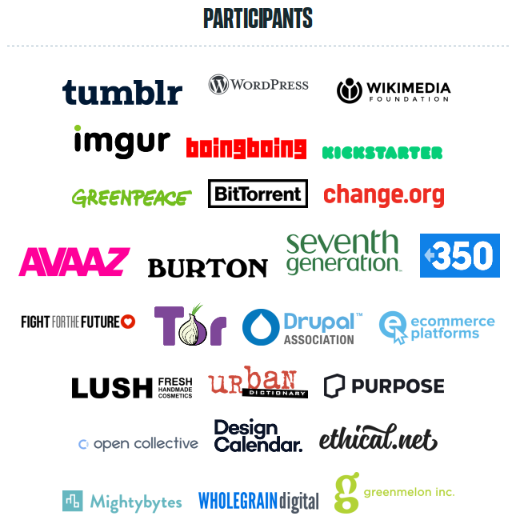

Title: XSS in The Digital #ClimateStrike Widget
Date: 2019-09-23
Author: Frederik
Slug: xss-digital-climate-strike

Life keeps me busy, which is why this blog is seeing less and less publications. It's also the reason why I couldn't join the Global Climate Strike on September 20th. Friends have pointed me towards the [_Digital_ Global Climate Strike](https://digital.globalclimatestrike.net/), where you can embed a script in your website and it will "go dark" on the strike day, drawing attention to the issue and calling people for action.

The widget waits until September 20th 2019 and expands to a big green banner that would block the whole page. Now that the strike is over, it's just a no-op.


Many organizations and websites took part in the Digital Global Climate Strike. Among them: tumblr, wordpress, imgur, wikimedia, boingboing, kickstarter, greenpeace, bittorrent, change.org, Tor project and many many more.



JavaScript and web security is my cup of teap so I couldn't help bug dig in. Maybe this would be a fun opportunity to contribute?

The websites also links to [the _digital-climate-strike_ GitHub repository](https://github.com/fightforthefuture/digital-climate-strike) and invites to collaborate. OK, let's give this a read. The file and commit id I am reading is [https://github.com/fightforthefuture/digital-climate-strike/blob/0eb2621d0de84adbf9f8d88f99aa3b0e7486f7b9/static/widget.js](https://github.com/fightforthefuture/digital-climate-strike/blob/0eb2621d0de84adbf9f8d88f99aa3b0e7486f7b9/static/widget.js)


The source code starts with a list of settings that might be set on the parent page to allow the overlay be closed (or permanent) or redirect to a self-hosted copy of the widget and so on. `iframeHost` defines the hostname of the iframe that is being added to the page.

```js
// …
  var DOM_ID = 'DIGITAL_CLIMATE_STRIKE';
  var options = window.DIGITAL_CLIMATE_STRIKE_OPTIONS|| {};
  var iframeHost = options.iframeHost !== undefined ? options.iframeHost : 'https://assets.digitalclimatestrike.net';
  var footerDisplayStartDate = options.footerDisplayStartDate || new Date(2019, 7, 1);       // August 1st, 2019 - arbitrary date in the past
  var fullPageDisplayStartDate = options.fullPageDisplayStartDate || new Date(2019, 8, 20);  // September 20th, 2019
// …
```

Below is a function `getIframeSrc()` that uses the `iframeHost` above. It includes a language check and forwards some of the options to the iframe itself (e.g., when disabling Google Analytics).

The next function `createIframe()`  creates the actual element and sets the `.src` attribute according to the result of `getIframeSrc()` as defined previously.

Finally, it will add a message listener to get instructions from the iframe:
```js
window.addEventListener('message', receiveMessage);
```

Let's look into this `receiveMessage` function:
```js
function receiveMessage(event) {
  if (!event.data.DIGITAL_CLIMATE_STRIKE) return;

  switch (event.data.action) {
    case 'maximize':
      return maximize();
    case 'closeButtonClicked':
      return closeWindow();
    case 'buttonClicked':
      return navigateToLink(event.data.linkUrl);
  }
}
```

Wait a minute. The message does not have to come from the climate strike iframe. The function receives a message through the `postMessage` API and checks whether the received object contains a `DIGITAL_CLIMATE_STRIKE` attribute. But the website itself could be put into a frame and the parent website would then be able to send messages like this. Alternatively, if the website does not allow being put into a frame (and [it should](https://frederik-braun.com/x-frame-options-security-header.html)!), it could be opened as a new tab/popup and then receive messages.
Depending on further message content, it will call the function `closeWindow()`, `maximize()` or `navigateToLink()`. The last one sounds most interesting. Let's follow along:

```js
function navigateToLink(linkUrl) {
  document.location = linkUrl;
}
```

OK. This function is meant to be a simple redirect. However, the `linkUrl` is not being checked against a list of known URLs. We could just redirect to `javascript:` URLs.
Navigations to `javascript` URLs are an old and weird way to execute JavaScript code. **We have just found a Cross-Site Scripting bug**.

Here's what an attacker would need to do:
Just open the victim website in iframe or popup in a way which leaves you with a JavaScript handle for the tab/window. The XSS is then easily triggered with something like
```js
handle.postMessage({
  DIGITAL_CLIMATE_STRIKE: true,
  action: 'buttonClicked',
  linkUrl: 'javascript:alert(1)'
  }, "*");
```

To be clear, I found this bug a week before the strike and wrote a patch that fixes the issue.
The patch adds two checks. First of all the `receiveMessage()` function gets a check that only allows for messages from the real iframe. The hostname was defined in `iframeHost` as explained in the beginning. Furthermore, we want to limit the `navigateToLink` function so it only allows visiting actual websites. The patched `receiveMessage()` function is therefore:

```js
  function receiveMessage(event) {
    if (!event.data.DIGITAL_CLIMATE_STRIKE) return;
    if (event.origin.lastIndexOf(iframeHost, 0) !== 0) return;

    switch (event.data.action) {
      case 'maximize':
        return maximize();
      case 'closeButtonClicked':
        return closeWindow();
      case 'buttonClicked':
        if (event.data.linkUrl.lastIndexOf('http', 0) !== 0) return;
        return navigateToLink(event.data.linkUrl);
    }
  }
```

Kudos to the team for acknowledging and accepting the fix in a timely manner! 
