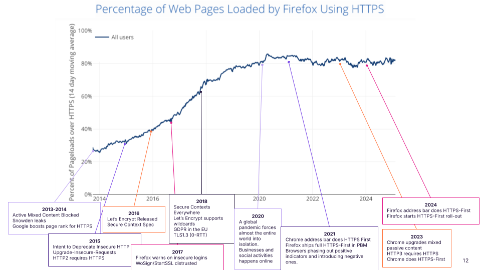

Title: With Carrots & Sticks - Can the browser handle web security?
Date: 2025-04-08
Author: Frederik
Slug: madweb-keynote-2025

NB: This is the blog version of my talk from [Measurements, Attacks, and Defenses for the Web (MADWeb)](https://madweb.work/) 2025, earlier this year. It was not recorded.

In my talk, I examined web security through the browser's perspective. Various browser features have helped fix transport security issues and increase HTTPS adoption:

HTTPS adoption was brought to over 90% in ten years. This happened with encouragements in the form of providing more exciting APIs only to Secure Context or deprecating features (like with Mixed Content Blocking).

# HTTPS Adoption over time



HTTPS is probably the main success story in web security.

I've allowed myself to collect a few interesting milestones in the last ten years of HTTPS. Thanks to folks who replied on mastodon and internally at Mozilla to help come up with a few). Note these are based on anecdote rather than a real scientific correlation.

Starting at 2013/2014, the web was already blocking mixed active content. The Snowden leaks came out and Google also reported to increase the page rank for sites that use HTTPS.

The year 2015 had the release of the [Upgrade Insecure Requests](https://www.w3.org/TR/upgrade-insecure-requests/) feature, as well as the release of HTTP2 which requires HTTPS. Richard Barnes at Mozilla called for a [deprecation of insecure HTTP](https://blog.mozilla.org/security/2015/04/30/deprecating-non-secure-http/).

In the following year, Let's Encrypt became globally available. 2016 is also when the [Secure Context specification](https://www.w3.org/TR/secure-contexts/) came out, allowing specifications to require that an API is only available on HTTPS.

2017 could have been a major set back. Due to compliance issues browsers distrusted the popular (and free!) certificate authorities WoSign and StartSSL. Yet it only resulted in a minor change at global scale.

Then, in 2018, Firefox called for [Secure Contexts Everywhere](https://blog.mozilla.org/security/2018/01/15/secure-contexts-everywhere/), proposing that new and powerful web APIs should all require HTTPS. Additionally, GDPR came into effect requiring HTTPS for logins and payments. The availability of wildcard certificates on Let's Encrypt also made deployment much easier for web servers hosting many subdomains.

The beginning of year 2020 was overshadowed by the global COVID-19 pandemic, which caused lockdowns world wide. People were forced into isolation which resulted in a significant rise of online communication and also HTTPS.

In 2021, Firefox and Chrome shipped a first "slice" of an HTTPS-First mode. A mode in which the browser upgrades requests to HTTPS with a fallback to HTTP if the secure connection can not be established. Firefox's first slice limits this to Private Browsing Mode. Chrome only does it for page loads from the address bar. It's also the year where browsers started phasing out positive indicators for HTTPS (the lock icon) and switching to negative indicators for insecure pages.

Then, in 2022 Chrome started upgrading mixed content (HTTP content on HTTPS pages), without any fallback, then moves on to ship HTTPS-First as a default for all new page loads. Firefox follows suit with the address bar and then completely by default in early 2025.

## Observations on the rise of HTTPS

It is interesting, that most of these efforts are more of a carrot than a stick.

This is because we don’t like to break existing websites, so we have to entice authors to follow our carrot. But once we are at a certain percentage, like 99.9%, could we actually get out the stick?

In light of these successful interventions as the browser's carrots and sticks - rewards for secure practices and penalties for insecure ones - we will then identify what can we could do to further apply security improvements.

In particular, we should look at highly prevalent security issues in client code, like XSS and CSRF. In the end, we will see how the browser can play an instrumental role in web security improvements and what common tactics and potential issues exist.

Maybe we can posit that all web bugs are in fact browser bugs?

If so, what could this mean for the [two most prevalent web security vulnerabilities](https://cwe.mitre.org/top25/archive/2024/2024_cwe_top25.html#top25list), Cross-Site-Request-Forgery (CSRF) and Cross-Site Scripting (XSS).

# Deprecations, e.g., CSRF

We do not remove features from the web lightly (see [W3C HTML Design Principles](https://www.w3.org/TR/html-design-principles/) and [my previous blog post](https://frederikbraun.de/modern-solutions-xsleaks.html)).

Often times, a feature or default pattern is modified like this:

- Offer a new API that solves a problem (e.g., `SameSite=Strict` cookie attribute solves CSRF)
- Discourage the usage. Warn in Developer Tools. Mark as deprecated.
- Allow websites to opt-out of existing behavior (e.g., `SameSite=Lax` or `Strict`)
- Wait. More outreach?
- Switch default behavior (`SameSite=Lax` by default. Websites can still opt out)

This process usually takes many years.

With `SameSite` being default in Chromium-based browsers and Safari having shipped ITP and [Firefox having rolled-out Total Cookie Protection](https://blog.mozilla.org/en/products/firefox/firefox-rolls-out-total-cookie-protection-by-default-to-all-users-worldwide/) (e.g., storage isolation) in 2022, most cookies should no longer be sent in cross-site requests per default.

## CSRF Outlook

There is still work to do to get rid of CSRF once and for all.

First of all, Chrome has shipped a bit of a deviation of what people would consider "lax by default" if taken literally. On [their article on explaining SameSite-Cookies](https://web.dev/articles/samesite-cookies-explained#samesitelax_by_default), they say their default is more permissive than an explicit `SameSite=Lax` cookie. Top-level `POST` requests [will still include cookies](https://groups.google.com/a/chromium.org/d/msg/blink-dev/AknSSyQTGYs/YKBxPCScCwAJ).

Secondly, browsers are working on cookie isolation by default, essentially deprecating all third party cookies. This work happens in the IETF as an [update on RFC6265 called `draft-ietf-httpbis-rfc6265bis-20`](https://datatracker.ietf.org/doc/draft-ietf-httpbis-rfc6265bis/).

With these challenges tackled, maybe CSRF will be dead in a few years?

# What if XSS was a browser bug?

Readers of my blog will know that I thoroughly enjoy talking about XSS. It's still the top-most reported security vulnerability and it's not a very complicated one.

I believe that XSS can be solved within the browser.

## XSS Mitigations in the past

### XSS filters

The year 2008 already saw XSS as the most-frequently reported vulnerability class at Microsoft, which lead them to build an XSS filter. An XSS filter is a mechanism that looks at the URL to identify potential injections and remove them from the request. Unfortunately, it led to hilarious bugs causing XSS in otherwise secure websites (e.g., Google).

This, in turn, led to the invention of the so-called XSS Auditor. It was presented in a paper ["Regular Expressions Considered Harmful in Client-Side XSS Filters" by Daniel Bates, Adam Barth, Collin Jackson](https://www.adambarth.com/papers/2010/bates-barth-jackson.pdf), suggesting to integrate it into the browser engine.

However, it soon met the same fate as the Microsoft XSS filter. At first, it was deemed not effective enough. In fact, it was so easy to bypass the XSS auditor, that the chrome teamremoved it from their bug bounty program, saying: "XSS auditor bypasses don't constitute Chrome security vulnerabilities".

This turnd more drastic soon, when people found out that you can also attack websites with the xss auditor that would otherwise be totally secure. (I wrote more about the [issues with the xss auditor in 2019](https://frederikbraun.de/xssauditor-bad.html)).

### Content-Security-Policy (CSP)

This leaves us with CSP. Another mitigation that attemps to fix XSS in the browser. The idea is to opt-in and then explicitly control where scripts are allowed to come from. Originally just allow-listing URLs of scripts and disallowing all inline scripts and event handlers.

CSP likely started with the [Content Restrictions idea from gerv](https://www.gerv.net/security/content-restrictions/), but was ratified as a W3C standard in 2013. Despite it's excellent theoretical security, it turned out to be not easily to deploy in almost all websites.

So, in quick succession (at least for standards work), CSP was extended into a version 2. The next version brought support for allow-listing inline scripts based on nonces (numbers used once, unique identifiers per-request/response) and cryptographic hashes (like SHA2).

However, CSP had to be adopted some more time. 2016 brought us CSP3 which was, among others, in response to the ["script gadgets" security research from Google](https://github.com/google/security-research-pocs/tree/master/script-gadgets). The idea behind this attack is that common Content Security Policies will allow-list Content Delivery Networks (CDNs), providing a multitude of JavaScript libraries. In fact, manyx CSPs will therefore implicitly also allow outdated and insecure versions of those libraries that could then be injected and turned into XSS again.

Despite 15 years of work on CSP and similar technologies, I personally consider it to be a failure in solving XSS for the masses. According to the [Web Almanac](https://almanac.httparchive.org/en/2024/security#content-security-policy),
less than 20% of websites have a CSP that even controls scripts. What's worse is that 90% of the CSPs out there still allow inline JavaScript. Essentially, providing no protection against XSS at all.

### Lessons on XSS protections

I believe a truly useful XSS protection:

- should be really easy to adopt (like the XSS filters, actually)
- should provide high cmpatibility with existing content (CSP was missing this from the get go).
- should focus on prevention rather than mitigation

## Outlook on XSS

Despite all the missteps, I think XSS can be solved after all. Especially, if we focus on DOM-based XSS first. DOM-based XSS is a variant of XSS where the bug is implemented in JavaScript & frontend technologies.

Two promising techniques will help prevent this in the near future.

First, the probably latest extension to CSP, is Trusted Types (TT). The idea behind TT is that you can no longer use typical strings in APIs that may lead to code execution (e.g., `eval` or assignments to `innerHTML` etc.). You could consider this the dynamic, runtime variant of the static analysis prevention that we use at Firefox, which I described in my earlier blog post ["Finding and Fixing DOM-based XSS with Static Analysis"](

https://frederikbraun.de/finding-and-fixing-dom-based-xss-with-static-analysis.html).

So, instead of allowing normal strings, you are required to provide a Trusted Type. These can only be created in specific functions that are rather easy to provide by a security team and simple to look for (in a code audit). Google claims it has [solved  all of XSS and stopped getting reports in their bug bounty program](https://static.googleusercontent.com/media/publicpolicy.google/en//resources/google_commitment_secure_by_design_overview.pdf) thanks to TT.

A second approach that will help solving XSS is the [Sanitizer API](https://github.com/WICG/sanitizer-api/). It builds on how people prevent XSS in their JavaScript codebases right now. But instead of relying on a third-party library like[DOMPurify](https://github.com/cure53/DOMPurify/), it will be built into the browser.

Essentially, shortening code form this:

```js
let clean = DOMPurify.sanitize(evil, options);
div.innerHTML = clean;
```

to this:

```js
div.setHTML(evil)
```

The new `setHTML` function will allow customizations, just like the DOMPurify library but will default to something sensible and secure. On top of that, most web sites will not have to worry about bugs in the sanitizer as they will be taken care of by the browser.

The `setHTML` function is already in the process of being upstreamed to WHATWG html.

## Solving XSS once and for all

So, with these techniques in mind, I believe we can fix DOM-based XSS once and for all by following the aforementioned steps for web deprecations.

- What if the Sanitizer could apply globally, with a header?
- What if XSS-risks like `innerHTML=` could be automatically rewritten to auto-sanitize like `setHTML()` does?
- What if this auto-sanitize behavior became an opt-out, rather than opt-in?

In fact, we have already developed this technology in Firefox's internals. We already make use of something like this to prevent sandbox escapes and other attacks in the Firefox UI bits. (cf. ["Hardening Firefox against Injection Attacks"](https://frederikbraun.de/hardening-firefox-against-injection-attacks-the-technical-details.html)). Since we shipped this, we have also received much less security bugs in our frontend code as part of our bug bounty program.

# Conclusion

Changing the web takes a lot of times. You need to consider lots of different initiatives. To improve and learn from the various attempts, you need to start with the "carrots" and provide opt-in security. This will allow building a new defaults that work for early adopters and eventually for everyone.

**I believe he most prevalent bugs should no longer be a website’s problem, but a browser problem**. The web ecosystem is fraught with some dangerous and widespread insecurity right now. I don't think the site is at fault.

**I believe we should shift the responsibility away from millions of websites and into the hands of the web platform**. And we have proven that it's possible with HTTPS, near-possible with CSRF and hopefully soon with XSS.

New, secure APIs will lead to a safer web for all.