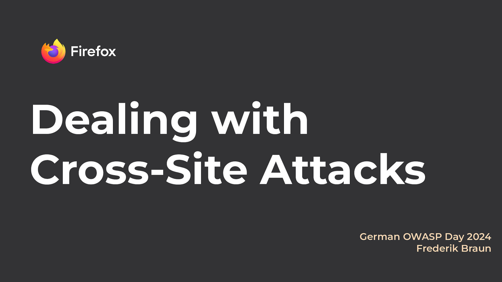
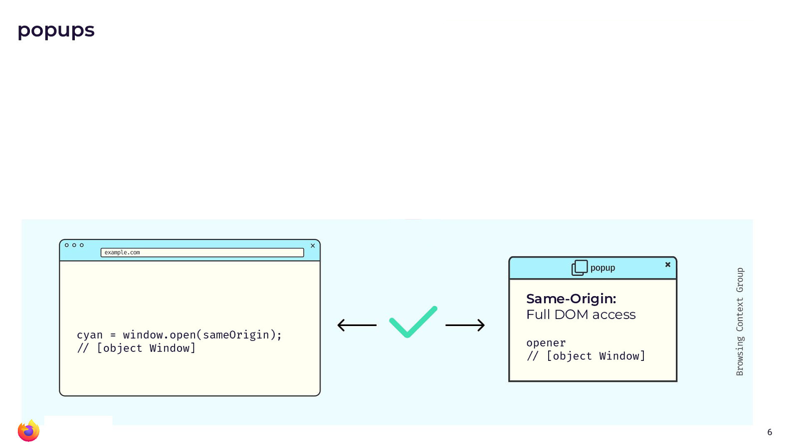
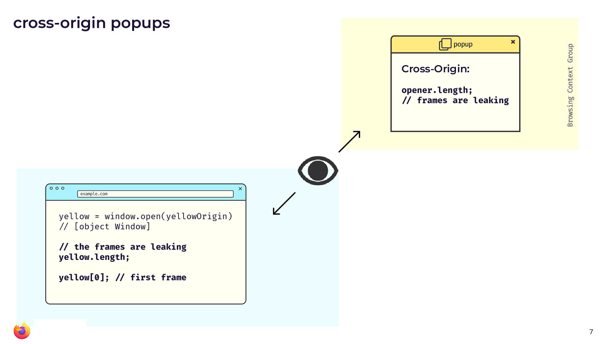
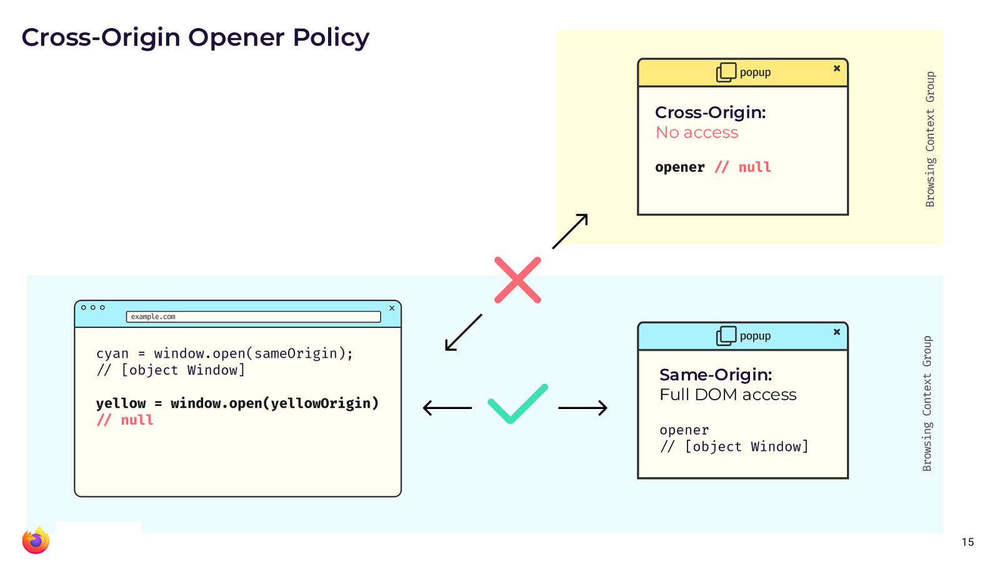
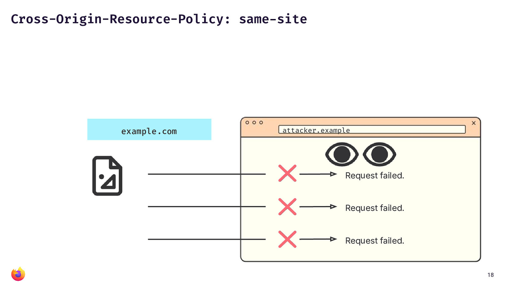
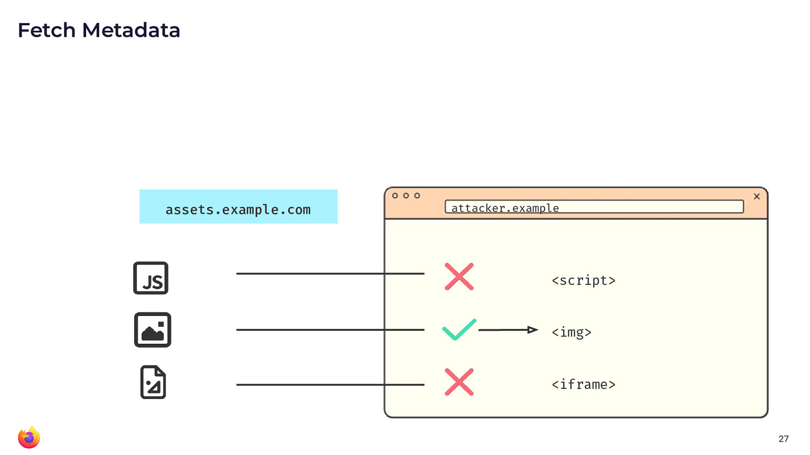

Title: Modern solutions against cross-site attacks
Date: 2024-11-26
Author: Frederik
slug: modern-solutions-xsleaks
tags: websecguide

*NB: This is the `text/html` version of my talk from the German OWASP Day 2024 in Leipzig earlier this month. If you prefer, there is also a [video from the event](https://media.ccc.de/v/god2024-56286-modern-solutions-against-c).*

{.slide}

This presentation is about cross-site leak attacks and what
recent defenses have been introduced to counter them. I also want to
finally answer the question why web security best practices is always
opt-in and finally how YOU can get increased security controls.


The [W3C HTML Design Principles](https://www.w3.org/TR/html-design-principles/) state that
> "When considering changes to legacy features or behavior... ... the benefit of the
> proposed change should be weighed against the likely cost of breaking
> content \[...\] In some cases, it may be desirable to make a nonstandard
> feature or behavior part of the conforming language, if it satisfies a
> valid use case."

So, in essence, this means that it should be avoided or at least be very
hard to remove APIs from the web, once they have been widely used.

## `XMLHttpRequest`
A great example is for this is `XML·Http·Request` (or XHR): The first
iteration of this API started with Microsoft building a proprietary
feature into IE 5 to dynamically make HTTP requests. It became widely
used and other browsers defined a standard around it - retroactively in
2006. I'm sure many readers have heard of or used `XMLHttpRequest`.
Though I bet very few of you actually use it for XML. And, we actually
have a better function. Remember what that one's called? Yep, `fetch`.
Can you guess how long we've had fetch()? Almost 10 years. And browsers
are still supporting XHR - they likely will keep doing so forever.

### The real world does not reflect best practices

In essence, the real world is always going to lag behind best practices.
That means, whenever you want to protect your website against an attack,
you will have to step up and do something on your own.

And this brings us to **Cross-Site Leaks (xsleaks)**: The issue with xsleaks - a we are about to
see - is that a lot of these attacks are very site-specific. Many of the
attacks in the xsleaks category depend on certain site behavior, like
for example timing attacks. Instead, we find a lot of usage of an API
that is totally fine and secure for some websites but may be horribly
insecure for others. xsleaks happen in the gray area, between "secure
API" and "insecure API".

### Detecting login status by leaking the amount of frames across origins

{.slide}

Popups are a good example. As you will see in the slide above, the return value of `window.open()`
gives a reference to the popup window. And the popup gets a reference to
the main window with the `opener` variable. If the pop-up is
same-origin, there is full DOM access through both of these window
handles.

{.slide}

For cross-origin popups (yellow window in the picture above), access is already restricted
but some stuff is still leaking: An example that might be somewhat odd
is that the `length` property can be used to identify how many frames a
window handle has. And just because of how some websites work, the
amount of frames can be used for login detection. Basically, whether you
are logged in or not results in some specific amount of frames, which is
the same value for all users and thus a worthy signal for attackers.

The authors of the [research paper "Finding All Cross-Site Needles in
the DOM Stack: A Comprehensive Methodology for the Automatic XS-Leak
Detection in Web
Browsers"](https://dl.acm.org/doi/pdf/10.1145/3576915.3616598) found that on 20 out of the top 50 web pages, they could
easily detect if the user was logged in.

But there are many more things that can leak across origins. The paper
[XSinator.com: From a Formal Model to the Automatic Evaluation of
Cross-Site Leaks in Web Browsers](https://xsinator.com) by the same authors shows that there are countless ways
to leak HTTP Status Codes, Response Headers, the amount of redirects
that URL experience, the length of a URL after redirects and so much
more.

So, in essence, there are a lot of cross-site leaks out there. They
might use images, videos, iframes, popups. These are all widely used and
important APIs that browsers can't directly remove or modify from the
web.

### What if we wanted to deprecate web APIs?

Let's take a quick detour and consider what it would look like to remove
an API in a distributed system? The way you usually deal with that is by
following roughly these four steps.

1.  You write a new improved function
2.  You disallow new code to use the old function (through a linter,
    static analysis, etc.)
3.  You start to refactor all existing code to use the new API. (You may
    have to iterate, change the new API, work with mismatched
    expectations. You may have to seek code review from a wide group of
    people and it will take a lot of time.
    But eventually - eventually! - you will get there. Because you
    removed new usage of the old API. If you were to track this in a
    line graph, the line plotting usage of the bad API would only know
    one direction. Down.)
4.  Eventually, you will be able to remove the bad API completely.


However, what would a deprecation on the web look like? Sure, we can
provide a new API. Of course, we can also discourage new usage of a bad
API though developer tools, warnings or advocacy. Maybe even reach out
to big websites. But essentially, you will never be able to control what
new code is written. In fact, there is *no* conceivable way to refactor
or rewrite existing code on the web.
So, we can not easily deprecate or discourage people from writing new code using bad APIs.
We simply can not remove bad APIs as long as they are widely used.

The best you can do is provide an opt-out: Encourage websites to not
make use of the bad APIs and allow them to state somewhere *a priori*
such that the browser may enable some new protections for them.

## Security headers are hope

However, there is hope. I believe that these options are worth it. And
there is value in looking into your site and adopting new protections,
when you can.

### `Cross-Origin-Opener-Policy` (COOP)

{.slide}

Speaking of these optional controls: There is a HTTP response header
called `Cross-Origin-Opener-Policy` (COOP) that allows your website to
opt out of providing window handles in cross-origin contexts.

If you provide a value of `same-origin`, then all popups for your own
website will continue to work. However, any cross-site popup situation
will lead to *removed* window handles.

As we have seen before, popups are not the only source of cross-site
leaks. So now, you wonder, how can you prevent your web page and its
content from being embedded on an attacker website.

### `Cross-Origin-Resource-Policy` (CORP)

{.slide}

Preventing your content from being embedded cross-site is easily done
with `Cross-Origin-Resource-Policy` (CORP) and a value of
e.g., `same-site`. In this case, you can rely that all sorts of embeds
are disallowed at the browser level (hey, anyone remember "hot link"
detections?). However, this might be too strict and not nuanced enough,
for example if some resources are public or are supposed to be used in some
contexts but not all.

### Fetch metadata request headers

But maybe these controls are not granular enough for you. Maybe, you
want to control on more aspects than just the origin or the site. Then
*Fetch Metadata Request Headers* are for you.

If you have recently inspected
a HTTP GET request in the browser, you might have noticed that it is
sending *a lot of headers*. These `Sec-Fetch`-prefixed headers provide a
great level of detail about what the browser is actually trying to do
with the resource it is requesting. Here is an example.

```
GET / HTTP/2
Host: example.com
Sec-Fetch-Dest: document
Sec-Fetch-Mode: navigate
Sec-Fetch-Site: none
Sec-Fetch-User: ?1
```

The headers will provide information about the [fetch
destination](https://fetch.spec.whatwg.org/#destination-table) (e.g., `img` element, `script` element etc.), the
[request
mode](https://fetch.spec.whatwg.org/#concept-request-mode) (e.g., cors) and the `site` (e.g., whether the request
was same-site, same-origin or cross-origin). **This can be used to build really granular security controls.**
In essence, by using Fetch metadata, you may build a protection that allows all sort of
same-site requests similar to what `CORP` (above) has already allowed.

{.slide}

However, you can provide more fine-grained access to some resources for
cross-origin content. For example, image inclusion might just be fine.
Whereas you may not want cross-origin content to load your scripts or
put your resources into an `iframe`.

### An interactive Demo

If you want to see a demo of this, try opening my test page
[https://noframes.on.web.security.plumbing/](https://noframes.on.web.security.plumbing/) Then open devtools and try loading that URL from an
`embed`, `object` or `iframe` element. Like in [this demo page from Live
DOM
Viewer](https://software.hixie.ch/utilities/js/live-dom-viewer/?saved=13285).

Do you see how it doesn't allow to be embedded?
If you take a look at the network tab in devtools (and refresh),
you will also notice that the request headers are indeed different for
each of these embedding attempts. Note, how the browser is sending all of
this specific metadata.

Going further, take a look at the [PHP source code for my demo
page](https://noframes.on.web.security.plumbing/?source). It's not brilliant,
but that's my point. You can build these kinds of protections with very little
code and they will work. (My code is for a "fun" interactive demo. Ideally, you would not build a
block-list of preventable request destinations. You should build an
allow-list of acceptable destinations).

```php
<?php
$headers = getallheaders();
if (isset($headers['Sec-Fetch-Dest'])) {
    $dest = $headers['Sec-Fetch-Dest'];
}
else {
    exit("This does not appear to be a valid browser request.\n");
}
// Frame protection
$forbidden_destinations = [
    'iframe' => "This page can not be embedded via iframe elements.\n",
    'object' => "This page can not be embedded via object elements.\n",
    'embed' => "This page can not be embedded via embed elements.\n",
    'fencedframe' => "Sorry, but fencedframs are not a thing.\n",
    'frame' => "Wow, the 90s called and want their frames back. No can do, friend.\n"
];
// Note, this is supposed to be an educational demo explaining how the
// ... destination is reacted to by the server.
// If you do this at home, convert the check into an allow list instead.
if (isset($forbidden_destinations[$dest])) {
    exit($forbidden_destinations[$dest]);
}
?>
```

This kind of protection is also called a ["resource isolation
policy"](https://xsleaks.dev/docs/defenses/isolation-policies/resource-isolation/).

### Closing thoughts

Security is opt-in, but the browser has your back and there are nice
ways to improve security gradually.
If you want to improve security **you have to move**.


##### References:
-   [xsleaks.dev](https://xsleaks.dev/)
-   [Cross-Origin-Opener-Policy on
    MDN](https://developer.mozilla.org/en-US/docs/Web/HTTP/Headers/Cross-Origin-Opener-Policy)
-   [Cross-Origin Resource Policy (CORP) on
    MDN](https://developer.mozilla.org/en-US/docs/Web/HTTP/Cross-Origin_Resource_Policy)
-   [Cross-Origin-Embedder-Policy on
    MDN](https://developer.mozilla.org/en-US/docs/Web/HTTP/Headers/Cross-Origin-Embedder-Policy)
-   [Security headers quick reference on
    web.dev](https://web.dev/articles/security-headers)
-   [Fetch metadata request header on
    MDN](https://developer.mozilla.org/en-US/docs/Glossary/Fetch_metadata_request_header)
-   [Protect your resources from web attacks with Fetch Metadata on
    web.dev](https://web.dev/articles/fetch-metadata)
-   [Fetch Metadata Request Headers
    playground](https://secmetadata.appspot.com/xss?value=your_value_here)

Thank you for reading.
