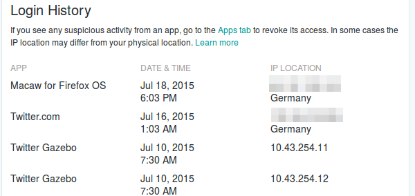

Title: The Twitter Gazebo
Date: 2015-07-18
Slug: twitter-gazebo
Author: Frederik

Earlier this week, Twitter rolled out a [new account dashboard](https://blog.twitter.com/2015/a-new-dashboard-to-help-you-monitor-and-manage-your-twitter-account). This new feature allows users to manage app access to their account and gain insights into previous logins and their metadata (IP address, app name and date).

Curious how this works or what my login history looks like, I gave it a quick test.

Wait, what's that? Twitter Gazebo?

I mean, it's OK to me that Twitter has access to my account data and that
it is [constantly analyzing all tweets and outgoing links of all users](https://blog.twitter.com/2014/fighting-spam-with-botmaker). That's what's making most web sites enjoyable these days: Fighting spam and removing malware is a common thing.

But what is this Gazebo and does is mean that someone actively used the log-in function to get into my account?

I will update this blog post, once I have found out…
