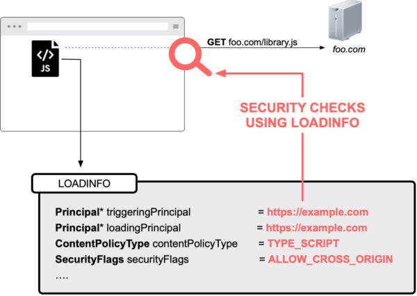

Title: Understanding Web Security Checks in Firefox (Part 1) 
Date: 2020-06-10
Author: Frederik

*This blog post has first appeared on the [Mozilla Attack & Defense blog](https://blog.mozilla.org/attack-and-defense/2020/06/10/understanding-web-security-checks-in-firefox-part-1/) and was co-authored with Christoph Kerschbaumer*

This is the first part of a blog post
series that will allow you to understand how Firefox implements Web
Security fundamentals, like the [Same-Origin
Policy](https://developer.mozilla.org/en-US/docs/Web/Security/Same-origin_policy).
This first post of the series covers the architectural design,
terminology, and introduces core interfaces that our implementation of
the Same-Origin Policy relies on:
[nsIPrincipal](https://searchfox.org/mozilla-central/source/caps/nsIPrincipal.idl)
and
[nsILoadinfo](https://searchfox.org/mozilla-central/source/netwerk/base/nsILoadInfo.idl).

 

Background on Web Security Checks
---------------------------------

Whenever Firefox on Desktop or Android
fetches a resource from the web, Firefox performs a variety of web
security checks to ensure web pages can not harm end users by performing
malicious actions. For example, when loading a sub-resource from a web
page, Firefox ensures that its URL is not targeting the local file
system with a file:// scheme. Before diving deeper into Firefox Security
internals we have to introduce the term 
Security Principal*
, which is key for understanding how Firefox
enforces web security checks.

 

The Security Contexts in Firefox
--------------------------------

All web related security checks within
Firefox are evaluated based on the security concept of a Principal.
Briefly, a Principal reflects a security context. E.g., when visiting
https://example.com a *
Content-Principal*
of https://example.com reflects the security
context of that page. More precisely, Firefox captures the security
context using one of the following four types of Principals:

1.  **Content-Principal**
     
    The [HTML
    specification](https://html.spec.whatwg.org/multipage/origin.html)
    associates an origin with a Document or a Worker. That origin
    information is encapsulated within a Content-Principal and reflects
    the security context for all web-hosted resources. E.g. when loading
    the web page https://example.com, then Firefox creates a
    Content-Principal encapsulating origin information of
    https://example.com which then reflects the security context of that
    web page.

2.  **Null-Principal**  
    In special cases, websites are
    never same-origin with anything else. Two such cases are iframes
    with a sandbox attribute and documents loaded with a data: URI. The
    HTML specification calls the origin of those pages an [opaque
    origin](https://html.spec.whatwg.org/multipage/origin.html#concept-origin-opaque).
    Our implementation uses a  *
   Null-Principal* 
   for reflecting the security context of
    an opaque origin. In contrast to a Content-Principal which
    internally maps to the origin of the resource, a Null-Principal uses
    a custom scheme and host, e.g. moz-nullprincipal:{0bceda9f-…}, where
    the host is represented as a UUID. So, when loading an iframe with a
    sandbox attribute Firefox internally generates a Null-Principal to
    reflect that security context. Please note that a Null-Principal is
    not equal to any other Principal and also not equal to any other
    Null-Principal. E.g., a data: URI iframe is not same-origin with
    another data: URI iframe because both security contexts are mapped
    through different Null-Principals.

3.  **System-Principal**
     
    The *
   System-Principal*
    is used for the browser’s user
    interface, commonly referred to as “browser chrome”. An example of a
    page with these extra privileges is “about:support”. The
    System-Principal is shared across all privileged resources, and
    implemented as a Singleton. Since browser chrome code does not rely
    on a URI, the System-Principal internally also does not map to an
    origin. The System-Principal passes all security checks.

4.  **Expanded-Principal**
     
    A browser extension is more privileged than normal web pages, but
    must also be able to assume the security context of a website.
    Hence, an *
   Expanded-Principal*
    is best understood as a *
   list of principals*
    to match the security needs for
    [Content
    Scripts](https://developer.mozilla.org/en-US/docs/Mozilla/Add-ons/WebExtensions/Anatomy_of_a_WebExtension#Content_scripts)
    in Firefox Extensions. When creating an Expanded-Principal Firefox
    takes multiple existing Principals, storing them in an allowlist.
    The security checks on the Expanded-Principal are then implemented
    as a loop through this allowlist of principals.

 The Loading Life-Cycle in Firefox
---------------------------------

Whenever a page performs a request,
Firefox internally creates an
[nsIChannel](https://searchfox.org/mozilla-central/source/netwerk/base/nsIChannel.idl)
object (which acts as the transport
algorithm, such as HTTP(S), WebSocket etc.). Amongst other things an
[nsIChannel](https://searchfox.org/mozilla-central/source/netwerk/base/nsIChannel.idl)
consists of an
[nsIURI](https://searchfox.org/mozilla-central/source/netwerk/base/nsIURI.idl),
which is the URI to be loaded, and an
[nsILoadInfo](https://searchfox.org/mozilla-central/source/netwerk/base/nsILoadInfo.idl)
object. The latter holds all security
relevant attributes including security flags indicating what security
checks need to be performed and the aforementioned Principal. It is
worth emphasizing that the loadinfo – including the Principal – gets
frozen at creation time and remains attached to the
[nsIChannel](https://searchfox.org/mozilla-central/source/netwerk/base/nsIChannel.idl)
instance even if the load encounters
any kind of redirect, e.g. a 302. The last step before Firefox starts
loading bits over the network is performing all relevant security checks
within the function
[asyncOpen()](https://searchfox.org/mozilla-central/rev/501eb4718d73870892d28f31a99b46f4783efaa0/netwerk/base/nsIChannel.idl#189)
of any
[nsIChannel](https://searchfox.org/mozilla-central/source/netwerk/base/nsIChannel.idl)
implementation.

 

Enforcing Web Security Checks in Firefox
----------------------------------------

Firefox enforces all [web security
checks by
default](https://blog.mozilla.org/security/2016/11/10/enforcing-content-security-by-default-within-firefox/)
by consulting a centralized
[ContentSecurityManager](https://searchfox.org/mozilla-central/source/dom/security/nsContentSecurityManager.cpp).
As mentioned, every
[asyncOpen()](https://searchfox.org/mozilla-central/rev/501eb4718d73870892d28f31a99b46f4783efaa0/netwerk/base/nsIChannel.idl#189)
implementation internally calls
[doContentSecurityCheck()](https://searchfox.org/mozilla-central/rev/501eb4718d73870892d28f31a99b46f4783efaa0/dom/security/nsContentSecurityManager.cpp#940)
which then performs all relevant web
security checks e.g., [Same-Origin
Policy](https://developer.mozilla.org/en-US/docs/Web/Security/Same-origin_policy),
[Content Security
Policy](https://developer.mozilla.org/en-US/docs/Web/HTTP/CSP), [Mixed
Content
Blocking](https://developer.mozilla.org/en-US/docs/Web/Security/Mixed_content).

To perform all relevant security
checks Firefox has to take *
multiple* 
principals into consideration, most notably
the
[loadingPrincipal](https://searchfox.org/mozilla-central/rev/501eb4718d73870892d28f31a99b46f4783efaa0/netwerk/base/nsILoadInfo.idl#254)
and the
[triggeringPrincipal](https://searchfox.org/mozilla-central/rev/501eb4718d73870892d28f31a99b46f4783efaa0/netwerk/base/nsILoadInfo.idl#304). 
The loadingPrincipal is the
principal of the document where the result of the load will be used. The
triggeringPrincipal is the
security context that actually triggered the URL to load. In most cases
the loadingPrincipal and the triggeringPrincipal are identical. One
example where loadingPrincipal and triggeringPrincipal differ is a
cross-origin CSS file requesting an image. In that case the
loadingPrincipal is a Content-Principal of the page where the image will
be loaded into, and the triggeringPrincipal is a cross-origin
Content-Principal of the CSS file.

Taking the loadingPrincipal and the
triggeringPrincipal into account, Firefox performs security checks in an
*asymmetric *
fashion. More precisely, a Principal may
have access to another Principal but not necessarily vice versa. This is
also why security checks are not implemented as equality checks.
Instead, Firefox relies on the concept of ‘subsumes’. In more detail,
Firefox uses aPrincipal-&gt;Subsumes(aOtherPrincipal), to see if
aPrincipal has access to
aOtherPrincipal.

The aforementioned System-Principal
subsumes all other principals, but a Null-Principal basically fails all
security checks and is only same-origin with itself. A Content-Principal
is same- origin to another Content-Principal if [scheme, host and
port](https://developer.mozilla.org/en-US/docs/Web/Security/Same-origin_policy)
are the same for both. If so, Firefox
allows the load.

 

An illustrative example of a Web Security Check
-----------------------------------------------

Let’s assume you visit the web page https://example.com and that page
then loads library.js from https://foo.com. For the JavaScript load to
occur Firefox will internally create an nsIChannel with the URL of
https://foo.com/library.js.

As illustrated, the loadinfo for that load would include the following
information: A triggeringPrincipal of https://example.com, because the
page https://example.com actually triggered the load to occur. The
loadingPrincipal would also be set to https://example.com because the
result of the JS load will be used in the security context of
https://example.com. The ContentPolicy type will be set to TYPE\_SCRIPT
which e.g., allows mapping of content type to Content Security Policy
directives (in this particular case to the script-src directive).
Finally, the security flags would be set to ALLOW\_CROSS\_ORIGIN because
JavaScript files are allowed to be loaded cross origin.

While in that particular case Firefox would allow the cross origin load,
it would still ensure that the web page is not trying to access the
local file system of the end user.

 

Going Forward
-------------

In this blog post, we explained how Firefox enforces Web Security
checks, like the Same-Origin Policy. In the next post we’ll explain how
to enable available logging mechanisms which allow for visual inspection
of every web security check performed. We hope that this introduction
will aid security research as well as bug bounty hunting and sparks your
curiosity to go further, even contribute to Mozilla and the Open Web.

  
